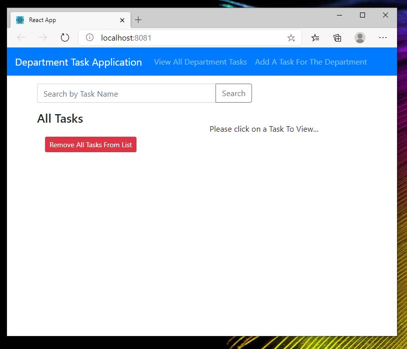
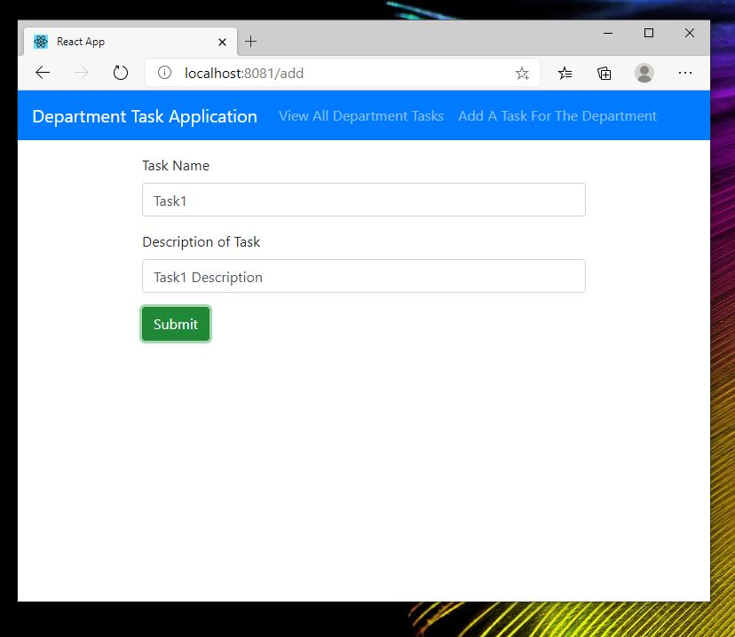

# WGUFinal

Full stack application written in node.js with React and Bootstrap on the front-end. Backend uses the express framework,
sequelize as the object relational mapper (ORM) and stores persistent data in a MySQL instance running on google cloud. 
Application was deployed on my personal google cloud platform using app engine and has since been destroyed. I wasn't too concerned about security
at the time, hence the egregious deviations from best-practices here. The goal was to get it up as quick as possible. The front-end and back-end were deployed on separate services.

The application is basically a CRUD (create, read, update, and delete operations) application. The idea is that a department, company, organization, or whatever
would have tasks to accomplish. They would add those tasks to the list as they come in. Then, a task completer would come along complete the tasks. This design allows
for easy retreival of metrics for future use as an analytical platform.

NOTE: You'll have to add your own config file for the db to get the server up.

-----------------CLIENT-RUNNING----------------------

The Home Screen lists all tasks that are to be completed. I didn't have the server up running to take screenshots but once the server is up and running the database can be populated and each task can be clicked on to edit and marked complete.

The Add Task provides the user to add a task to the database for viewing and completion later.

